# 物联网平台 OTA 固件升级方案深度对比与架构设计分析

本文深度对比分析了 `tmp/` 目录下的 5 个主流开源物联网项目（**ThingsBoard**、**JetLinks**、**ThingsPanel**、**FastBee**、**Magistrala**）与 **0things** 的 OTA（Over-The-Air）固件升级流程与架构设计，梳理各方案的核心机制、优缺点及对 0things 的架构演进建议。

---

## 1. 方案横向对比总览 (Comparison Matrix)

| 核心维度 | ThingsBoard (`thingsboard-master`) | JetLinks (`jetlinks-community-2.11`) | ThingsPanel (`thingspanel`) | FastBee (`FastBee-master`) | Magistrala (`magistrala-main`) | 0things (当前方案) |
| :--- | :--- | :--- | :--- | :--- | :--- | :--- |
| **语言与框架** | Java (Spring Boot + Netty + Akka) | Java (Spring WebFlux + Project Reactor + Vert.x) | Go (Gin + GORM + Go-Zero生态) | Java (Spring Boot + Netty/Vue) | Go (Go-kit + gRPC + Chi) | Go (Nunu架构 + Wire + GORM DAL) |
| **架构形态** | 分布式微服务 / 混合集群 | 全响应式异步微服务 | 单体轻量级应用 | 单体/基础微服务 | 分布式消息微服务 | 领域驱动轻量微服务 |
| **接入层实现** | **自研 Netty 网关** (无独立 Broker) | **Vert.x 响应式网关集群** | **外部 Broker (EMQX)** | **混合模式 (自研 Netty/EMQX)** | **NATS Core / EMQX 网关** | **外部 Broker (EMQX / 标准网关)** |
| **下发寻址机制** | **全局 Session 会话表** (Redis/Zk) $\rightarrow$ 专用节点 Topic 队列 | **分布式 EventBus 主题路由** (`/device/{prod}/{dev}/...`) | **Broker 主题路由** (无 Session 寻址) | **Broker/Netty 本地映射** | **Channels / Subtopics 路由** | **Broker 原生主题路由** + NATS 异步解耦 |
| **下发触发模式** | **主动 Push** (长连接) + **Shadow 轮询** (HTTP) | **Push 主动推** (`/firmware/push`) + **Pull 被动拉** (`/firmware/pull`) | **主动 Push** (`go func` 直推) | **延时队列 Push** (Redis DelayQueue) | **Channel 管道透传** | **主动 Push** (MQTT) + **Shadow 轮询** (HTTP) |
| **多协议支持** | MQTT, CoAP, LwM2M, HTTP, SNMP | MQTT, HTTP, CoAP, TCP/UDP, Modbus | 仅 MQTT | 主要 MQTT, 少量 HTTP/TCP | MQTT, HTTP, CoAP, WS | MQTT, HTTP, CoAP (统一 `pkg/event`) |
| **进度更新与聚合** | Transport $\rightarrow$ Core 驱动状态机 | 响应式 EventBus 流式响应与聚合 | 单体内部订阅 MQTT 直写 DB | 消息监听直写 DB/Redis 影子 | 消息总线透传，应用层自处理 | Transport $\rightarrow$ NATS $\rightarrow$ Data-Engine 原子聚合 |
| **运维与资源成本** | **极高** (JVM、Kafka、Cassandra/PG) | **中高** (JVM、Reactor、Redis/ES) | **极低** (单二进制 + PostgreSQL) | **中等** (Java + Redis/MySQL) | **极低** (Go 二进制 + NATS) | **极低/云原生** (Go单二进制、内存~30MB) |

---

## 2. 深度剖析：各开源项目的 OTA 方案实现

```mermaid
flowchart TD
    subgraph JetLinks["1. JetLinks (响应式 EventBus + Push/Pull 双向体系)"]
        JL_Core["DeviceManager / 固件管理"] -->|发布 Reactive 消息| JL_Bus["响应式 EventBus (/device/+/+/firmware/push)"]
        JL_Bus --> JL_Gateway["Vert.x 协议网关集群"]
        JL_Gateway -->|长连接 Push| JL_Dev["物理设备"]
        JL_Dev -.->|主动 Pull /firmware/pull| JL_Gateway
        JL_Dev -.->|上报进度 /firmware/progress| JL_Gateway -.->|EventBus 响应式聚合| JL_Core
    end

    subgraph ThingsBoard["2. ThingsBoard (自研 Netty 网关 + 会话路由)"]
        TB_Core["tb-core / Rule Engine"] -->|1. 查 Redis 会话定位物理机| TB_Redis[("Session 注册表")]
        TB_Core -->|2. 定向发布 Protobuf| TB_Kafka["Kafka (tb_transport.mqtt.node-01)"]
        TB_Kafka -->|3. 消费| TB_Trans["tb-transport-mqtt (Netty 网关)"]
        TB_Trans -->|4. 按 SessionId 写 Socket| TB_Dev["物理设备"]
    end

    subgraph ThingsPanel["3. ThingsPanel (单体应用 + EMQX 直发)"]
        TP_API["ThingsPanel 单体服务 (Go)"] -->|Paho MQTT 客户端直推| TP_EMQX["EMQX Broker"] --> TP_Dev["物理设备"]
    end

    subgraph FastBee["4. FastBee (Redis 延时队列流控)"]
        FB_API["FastBee Server"] -->|Redis 延时队列削峰| FB_Queue["OtaUpgradeDelayTask"] --> FB_MQTT["MqttMessagePublish"] --> FB_Dev["物理设备"]
    end

    subgraph ZeroThings["5. 0things (微服务解耦 + NATS 总线 + Broker)"]
        OT_Back["backend (控制中心)"] -->|发布 OTA 指令事件| OT_NATS["NATS JetStream (TopicOTAUpgradeCommand)"]
        OT_NATS -->|异步解耦| OT_Engine["data-engine / transport-mqtt"]
        OT_Engine -->|MQTT 发布 /ota/device/upgrade/...| OT_EMQX["EMQX Broker"] --> OT_Dev["物理设备"]
        OT_Dev -.->|原生协议上报| OT_Trans["transport-* (MQTT/HTTP/CoAP)"] -.->|TopicOTAProgressReport| OT_Engine
    end
```

---

### 项目一：JetLinks —— 全响应式 EventBus 与 Push/Pull 双向体系

#### 1. 核心流程与设计哲学
- **事件驱动与消息分类**：
  JetLinks 在 `DeviceMessageConnector.java` 中将固件升级设计为一套标准的全双工事件主题：
  - `UPGRADE_FIRMWARE` (`/firmware/push`)：平台主动向长连接设备推送升级包；
  - `REQUEST_FIRMWARE` (`/firmware/pull`)：休眠设备、HTTP 轮询设备或局域网设备唤醒后，主动向平台发起拉取请求；
  - `UPGRADE_FIRMWARE_PROGRESS` (`/firmware/progress`)：设备按百分比（0%~100%）上报安装进度与状态；
  - `REPORT_FIRMWARE` (`/firmware/report`)：设备开机、上线或升级完成时上报当前固件版本。
- **底层流转（Project Reactor + Vert.x）**：
  - 网关层与业务层通过内部响应式 **EventBus** 进行解耦（主题结构形如 `/device/{productId}/{deviceId}/firmware/push`）；
  - 采用全非阻塞响应式编程（`Flux`/`Mono`），大批量下发时天然具备背压（Backpressure）流控能力。

#### 2. 优缺点分析
- **优势**：Push / Pull 双向模型设计极为完善；响应式 EventBus 支持无锁高并发与流式聚合。
- **劣势**：全响应式（Reactive）代码调试成本高，学习曲线陡峭。

---

### 项目二：ThingsBoard —— 自研网关与全局 Session 寻址

#### 1. 核心流程
- **下发寻址**：`tb-core` 必须通过 Redis 查询设备连接在哪个具体的网关实例（如 `node-01`），向专有 Topic `tb_transport.mqtt.node-01` 投递 Protobuf 消息。
- **物理写入**：Netty 网关在内存中通过 `SessionId` 找到 `ChannelHandlerContext` 刷入 TCP Socket。
- **HTTP 模式**：无连接设备不走队列，更新 `Shared Attributes` 供设备轮询。

#### 2. 优缺点分析
- **优势**：协议网关与核心完全解耦，支持超大规模复杂工业协议。
- **劣势**：架构非常厚重（JVM/Kafka/Cassandra/Redis），应用层承担了原本属于 Broker 的连接寻址重任。

---

### 项目三：ThingsPanel —— 经典 Go 单体直连 Broker

#### 1. 核心流程
- 单体 Go 服务查库确认设备在线后，在进程内通过 `paho.mqtt.golang` 客户端构造 JSON，直接 `go publish.PublishOtaAdress(...)` 直推 EMQX 主题 `/ota/device/upgrade/{productKey}/{deviceName}`。
- 同进程内启动订阅协程监听进度并直写数据库。

#### 2. 优缺点分析
- **优势**：极简、链路最短、排查直接。
- **劣势**：业务与通信高度耦合，缺乏跨协议支持和批量并发削峰保护。

---

### 项目四：FastBee —— SpringBoot + Redis 延时队列流控

#### 1. 核心流程
- 批量升级创建后，将任务封装为 `OtaUpgradeBo` 放入 Redis 延时队列（`OtaUpgradeDelayTask`），实现滑动窗口式的分批分流下发，防止流量突发冲顶。

#### 2. 优缺点分析
- **优势**：轻量解决批量下发的突发网络流量冲顶。
- **劣势**：深度耦合 SpringBoot 与单体逻辑。

---

### 项目五：Magistrala (Mainflux) —— 纯 NATS Channel 管道透传

#### 1. 核心流程
- Magistrala 是纯 Go 编写的微服务 IoT 消息底座；
- 它通过 `Things` 与 `Channels` 机制建立多对多的 NATS 主题管道，所有下行控制指令通过 Channel 权限校验后经 NATS 转发给协议适配器（MQTT/CoAP/HTTP/WS）。

#### 2. 优缺点分析
- **优势**：极致的微服务解耦与高性能 NATS 管道。
- **劣势**：属于纯消息通道底座，平台层未内置高级的批量 OTA 状态机与进度聚合。

---

## 3. 0things 当前架构评估与演进建议

### 0things 的架构定位
0things 融合了各项目的优点：
1. **吸收 JetLinks / ThingsBoard 的协议解耦精髓**：统一在 `0things/pkg/event` 中维护 `OTAUpgradeCommand`、`OTAUpgradeReport` 契约，支持 MQTT 主动推与 HTTP 轮询拉；
2. **吸收 Magistrala / ThingsPanel 的轻量级设计**：采用 Go 原生极低内存占用（~30MB），依托成熟 EMQX Broker 集群，省去了 ThingsBoard 复杂的 Session 状态机；
3. **引入 NATS JetStream 现代化消息底座**：确保跨微服务异步通信的持久化与削峰能力。

### 0things 现行下行与上行闭环架构

$$\text{【下行】: backend (发布指令)} \xrightarrow{\text{NATS (TopicOTAUpgradeCommand)}} \text{transport-mqtt (网关消费下推)} \xrightarrow{\text{EMQX}} \text{设备}$$
$$\text{【上行】: 设备} \xrightarrow{\text{EMQX}} \text{transport-mqtt (网关接入)} \xrightarrow{\text{NATS (TopicOTAProgressReport)}} \text{data-engine (流处理与进度聚合)} \xrightarrow{\text{DB 落库}}$$

1. **下发与接入职责统一收归 Transport 网关**：
   - 由 `transport-mqtt` 负责 MQTT 的双向 Ingress/Egress 通道（既把设备上行数据转发到 NATS，也消费 NATS 指令推送至 EMQX）；
   - `data-engine` 彻底移除 MQTT 依赖，专注于 **OTA 进度统计聚合、时序落库与告警计算**（纯计算无出口网络依赖）。
2. **支持 Push / Pull 双模（参考 JetLinks）**：
   - 长连接（MQTT）设备走 `TopicOTAUpgradeCommand` 主动推送；
   - 轮询/休眠设备（HTTP）保留 `GET /api/v1/ota/info` 唤醒拉取模式。
